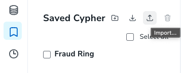

# fraud-detection-training

This is a Neo4j training in which you will be exposed to:

- Neo4j workspace environment
- modeling
- some basic cypher
- more advanced cypher capabilities
- ingestion
- connectors
- Graph Data Science

To do this training, just follow this [tutorial](./queries/fraud_detection_with_neo4j.md).

Queries can be copied from the tutorial to [workspace](https://workspace-preview.neo4j.io/) UI we recommend to use whatever the environment.

Alternatively to the copy/paste approach, you'll have a better experience downloading this workspace [script](./queries/queries_for_aura_workspace.csv) and import it to the workspace bookmarks sections.

Half of the training (cypher and advance cypher) can be done with an [Aura](https://console.neo4j.io/) Free instance, [Neo4j Desktop](https://neo4j.com/download/) or a blank [Neo4j Sandbox](https://neo4j.com/sandbox/).

The RBAC and GDS parts can be done from Neo4j Desktop or a blank Neo4j Sandbox.