# APP Fraud ring - A training

## Introduction

## Environment

### User Interface

For a seamless experience, this training should be done using [Neo4j Workspace](https://workspace-preview.neo4j.io/). Workspace can be used with any Aura, Sandbox or Desktop instance.

### Instance

#### Alternative 1 - Creating a Aura Free instance

The first half (sprint 1 , sprint 2) only of this training can be done with a Neo4j Aura Free instance.

Connect to your [Aura Console](https://console.neo4j.io/).

Create an Aura free instance.

#### Alternative 2 - Neo4j Desktop

The full training can be done with Neo4j Desktop.
Install Neo4j Desktop and create a Neo4j 5.9+ database.
- APOC and GDS plugin should be installed,
- This setting file line must not be commented:
`dbms.security.allow_csv_import_from_file_urls=true`
- Use `neo4j` schema to connect to `localhost` from [workspace](https://workspace-preview.neo4j.io/).


#### Alternative 3 - Neo4j Sandbox

A [Blank Sandbox](http://sandbox.neo4j.com) is convenient for the whole training.

### Queries

Queries can be copied from the tutorial to [workspace](https://workspace-preview.neo4j.io/) UI.

Alternatively to the copy/paste approach, you'll have a better experience downloading this workspace [script](./queries_for_aura_workspace.csv) and importing it to the workspace bookmarks sections.

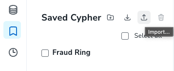

## Context

### Credits

This use case is set as in Neo4j Industry [Use Case study](https://neo4j.com/developer/industry-use-cases/finserv/retail-banking/transaction-ring/) and it shows how it was [updated](https://neo4j.com/developer/industry-use-cases/finserv/retail-banking/transaction-ring/transaction-ring-node-version/) to leverage Neo4j 5 new features.

### Use Case

A **transaction fraud ring** refers to a group of people collaborating to engage in fraudulent activities, like transferring funds through multiple accounts. They try to **hide their tracks in the multitude of transactions**, but when you take a step back, you see these **patterns** of people hiding their money flows pop-out again from the regular transactions graphs. These rings work across different locations and employ diverse strategies to evade detection. It is critical for financial organizations to detect these rings, especially with enhancement to the Contingent Reimbursement Model (CRM). One of the fastest-growing scams is the Authorized Push Payment (APP) fraud. In the UK, according to UK Finance, it resulted in a loss of over £249 million in the first half of 2022, a 30% increase compared to the same period in 2020.

### Query specification

To detect these frauds, we have to **find non-repeating chronologically-ordered cycles** inside a graph of transactions between accounts. **From one transaction of this cycle to the next one, a slice of the amount (up to 20%) may be taken by the account**. It looks like a great use case for pattern matching with Cypher query language.

![A fraud ring in a monopartite (:Account)-[:TRANSACTION]->(:Account) graph](../assets/images/fraud_ring.png)

## First sprint - good old Cypher

### Data Modeling

> "Monopartite graphs are the way when you're doing deep traversal of your graph." says some skilled cypher dev.

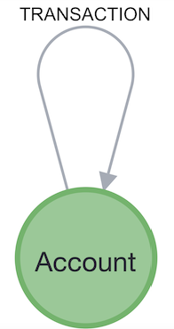

### Inserting sample data

Let's run this script. It creates 4 accounts (if not exist) and 8 transactions between them. It will help us build a cypher query.

```cypher
// Create all accounts
MERGE (a1:Account {a_id: "1"})
MERGE (a2:Account {a_id: "2"})
MERGE (a3:Account {a_id: "3"})
MERGE (a4:Account {a_id: "4"})


// Create relationships between accounts
CREATE (a1)-[:TRANSACTION {amount: 1000, currency: "gbp", date: datetime()-duration({days: 3})}]->(a2)
CREATE (a2)-[:TRANSACTION {amount: 900, currency: "gbp", date: datetime()-duration({days: 2})}]->(a3)
CREATE (a3)-[:TRANSACTION {amount: 810, currency: "gbp", date: datetime()-duration({days: 1})}]->(a4)
CREATE (a4)-[:TRANSACTION {amount: 729, currency: "gbp", date: datetime()}]->(a1)
CREATE (a2)-[:TRANSACTION {amount: 700, currency: "gbp", date: datetime()-duration({days: 6})}]->(a3)
CREATE (a3)-[:TRANSACTION {amount: 978, currency: "gbp", date: datetime()-duration({days: 5})}]->(a4)
CREATE (a4)-[:TRANSACTION {amount: 210, currency: "gbp", date: datetime()-duration({days: 4})}]->(a1)
CREATE (a1)-[:TRANSACTION {amount: 29, currency: "gbp", date: datetime()}]->(a2)
```

Let's look at the resulting schema.

```cypher
CALL db.schema.visualization()
```

### Finding a cycle

Feel free to use [Cypher cheat sheet](https://neo4j.com/docs/cypher-cheat-sheet/5/auradb-enterprise/) as often as you need. Is a great place to find just the information you need about cypher.

#### First: get a node...

```cypher
// Get some nodes
MATCH (n:Account)
RETURN n
LIMIT 10
```

```cypher
// Get a constrained node
MATCH (n:Account {a_id:"2"})
RETURN n
```
```cypher
// Get a constrained node (alternative)
MATCH (n:Account)
WHERE n.a_id = "2"
RETURN n
```

```cypher
// Get aconstrained node (alternative - inner `WHERE`)
MATCH (n:Account WHERE n.a_id = "2")
RETURN n
```

#### ...then a relationship...

```cypher
// Get outgoing tx from node
MATCH (a:Account {a_id:"2"})-[tx:TRANSACTION]->(n)
RETURN a, tx, n
```

#### ... then a path ...

```cypher
// Get outgoing path from a node
MATCH path = (a:Account {a_id:"2"})-[tx:TRANSACTION*0..3]->(n)
RETURN path
LIMIT 10
```

#### ... any path ...

```cypher
// Get outgoing path from a node
MATCH path = (a:Account)-[tx:TRANSACTION*0..3]->(n:Account)
RETURN path
LIMIT 10
```

#### ... finally a cycle

```cypher
// Identify simple transaction ring
MATCH path=(a:Account)-[:TRANSACTION*2..6]->(a)
RETURN path
```

### Finding a *non-node-repeating* cycle

- We can get the nodes of the path as an array with the [path function](https://neo4j.com/docs/cypher-cheat-sheet/5/auradb-enterprise/#_list_expressions) `nodes()`.
- We can get the size of the array with the [list function](https://neo4j.com/docs/cypher-cheat-sheet/5/auradb-enterprise/#_list_expressions) `size`.
- We can distribute an array into rows with [`UNWIND`](https://neo4j.com/docs/cypher-cheat-sheet/5/auradb-enterprise/#_unwind).
- We can project rows on some/new dimensions with [`WITH`](https://neo4j.com/docs/cypher-cheat-sheet/5/auradb-enterprise/#_lists) and use it to chain parts of a query.
- We can remove duplicate rows with `DISTINCT` [operator](https://neo4j.com/docs/cypher-cheat-sheet/5/auradb-enterprise/#_operators) to get non repeating nodes.
- We can [aggregate](https://neo4j.com/docs/cypher-cheat-sheet/5/auradb-enterprise/#_aggregating_functions) and count with `count()`.
- `GROUP BY` is implicit in cypher. This is not a key-word.

We can build a query that filters the path by counting the number of nodes `c_nodes` and comparing it to the number of distinct nodes `c_unique_nodes`.

```cypher
// Identify simple transaction ring
MATCH path=(a:Account)-[:TRANSACTION*2..6]->(a)
UNWIND nodes(path) AS n
WITH path, size(nodes(path)) AS c_nodes, n
WITH DISTINCT path, c_nodes, n
WITH path, c_nodes, count(n) AS c_unique_nodes
WHERE c_nodes = c_unique_nodes + 1
RETURN path
```

We must admit this query is not concise and, worst, not easily readable. We can use [`APOC`](https://neo4j.com/labs/apoc/5/), Neo4j's standard library to get something more human-friendly.

```cypher
// No duplicate
MATCH path=(a:Account)-[tx:TRANSACTION*2..6]->(a)
WHERE size(apoc.coll.toSet(nodes(path))) = size(nodes(path)) - 1
RETURN path
```

### Finding a *non-node-repeating* cycle with consistent dates

We want increasing transaction dates along our cycle.

- We use `range()`to generate a [list](https://neo4j.com/docs/cypher-cheat-sheet/5/auradb-enterprise/#_aggregating_functions) of indices.
- and `all(... WHERE ...)` [list predicate](https://neo4j.com/docs/cypher-cheat-sheet/5/auradb-enterprise/#_list_expressions) to ensure all elements in a list are `true`.

For each path, it enables us to compare dates of consecutive nodes.

```cypher
// Monotonic dates
MATCH path=(a:Account)-[tx:TRANSACTION*2..6]->(a)
WHERE size(apoc.coll.toSet(nodes(path))) = size(nodes(path)) - 1
AND all(idx in range(0, size(tx)-2)
       WHERE (tx[idx]).date < (tx[idx+1]).date
   )
RETURN path
```

### Finding a *20%*-rule-complient *non-node-repeating* cycle with consistent dates

Like what we just did with dates before, we want to compare attributes of consecutive transactions. It fits well in our `all()` list predicate so we will use a `AND` boolean [operator](https://neo4j.com/docs/cypher-cheat-sheet/5/auradb-enterprise/#_operators) to put this rule inside `WHERE`.  

```cypher
MATCH path=(a:Account)-[tx:TRANSACTION*2..6]->(a)
WHERE size(apoc.coll.toSet(nodes(path))) = size(nodes(path)) - 1
AND all(idx in range(0, size(tx)-2)
       WHERE (tx[idx]).date < (tx[idx+1]).date
       AND tx[idx].amount >= tx[idx+1].amount >= 0.80 * tx[idx].amount
   )
RETURN path
```
## Review phase

Our queries runs perfectly fine on our sample data but our developper has noticed some limitations :

> "I've made some tests on a more realistic [dataset](../data_importer_schema_with_data/importMonopartite10Kaccs100Ktxs.zip) (I've imported it seemlessly with Aura workspace's [data-importer](https://workspace-preview.neo4j.io/workspace/import) - just *open model (with data)* from three-dot menu). And... well... I'm afraid our query doesn't scale well. By the way I even had to put a limit on the length of the path because when there wasn't any, the query was running forever (or until a memory allocation error)."

Some other developer :

> "The pattern-matching-based *traverse, produce and filter* approach might not scale if the graph is dense and traversals are deep.
In some cases, it produces way to many paths! Look at the PROFILE of the query!
I think filtering at each traversal step is possible.
Did you read [this article](https://medium.com/neo4j/getting-from-denmark-hill-to-gatwick-airport-with-quantified-path-patterns-bed38da27ca1) and [this other one](https://medium.com/neo4j/did-you-take-the-neo4j-5-cypher-bullet-train-6a857c92d669), it seems that we can do much better if we leverage Neo4j 5 new features."

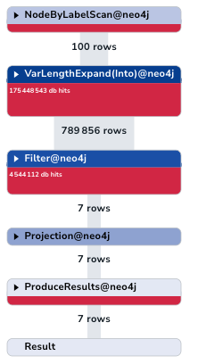

Product owner :

> "Our products needs real-time fraud detection so we need faster queries. We also need to be able to capture long cycles. This has to be the direction of the next sprint!"

## Second sprint - Neo4j 5 Cypher

### Data Modeling

> "We've identified to opportunities to make our query better. One is using `count{<subquery>}` syntax to get rid of `APOC` dependency. The second one is the use of [`quantified path patterns`](https://neo4j.com/docs/cypher-manual/current/patterns/concepts/#quantified-path-patterns). To get the best out of QPPs, we should refactor our model into a bipartite graph."

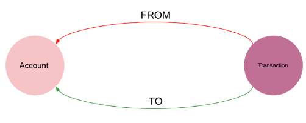

### Inserting sample data

```cypher
// Clean database
// 
// WARNING! 
// This DROPs all your indexes and constraints
//
CALL apoc.schema.assert({},{});

// WARNING!
// This erase all your DB content
//
MATCH (n)
CALL {WITH n DETACH DELETE n}
IN TRANSACTIONS OF 100 ROWS;

// Create all accounts
MERGE (a1:Account {a_id: 1})
MERGE (a2:Account {a_id: 2})
MERGE (a3:Account {a_id: 3})
MERGE (a4:Account {a_id: 4})


// Create relationships between accounts
CREATE (a1)<-[:FROM]-(:Transaction {amount: 1000, currency: "gbp", date: datetime()-duration({days: 3})})-[:TO]->(a2)
CREATE (a2)<-[:FROM]-(:Transaction {amount: 900, currency: "gbp", date: datetime()-duration({days: 2})})-[:TO]->(a3)
CREATE (a3)<-[:FROM]-(:Transaction {amount: 810, currency: "gbp", date: datetime()-duration({days: 1})})-[:TO]->(a4)
CREATE (a4)<-[:FROM]-(:Transaction {amount: 729, currency: "gbp", date: datetime()})-[:TO]->(a1)
CREATE (a2)<-[:FROM]-(:Transaction {amount: 700, currency: "gdp", date: datetime()-duration({days: 6})})-[:TO]->(a3)
CREATE (a3)<-[:FROM]-(:Transaction {amount: 978, currency: "gdp", date: datetime()-duration({days: 5})})-[:TO]->(a4)
CREATE (a4)<-[:FROM]-(:Transaction {amount: 210, currency: "gdp", date: datetime()-duration({days: 4})})-[:TO]->(a1)
CREATE (a1)<-[:FROM]-(:Transaction {amount: 29, currency: "gdp", date: datetime()})-[:TO]->(a2)
```

Let's look at the resulting schema.

```cypher
CALL db.schema.visualization()
```

### Finding a cycle

In our bipartite model, a fraud ring is a cycle with this shape:
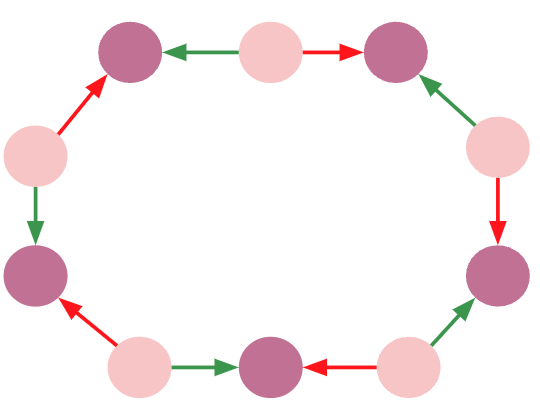

It can be drawn as a path ending where it starts.

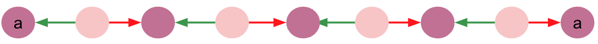

The QPP of our query will be a path of repeating patterns *anchored* on both sides on the same node.

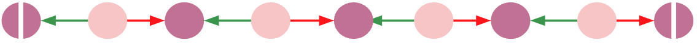


In cypher 5.9+, we put the repeating part of the [QPP](https://neo4j.com/docs/cypher-cheat-sheet/5/auradb-enterprise/#_quantified_path_patterns) between parenthesis.

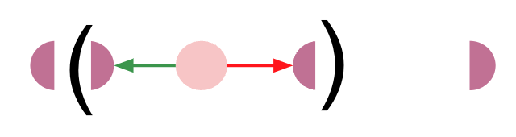

And the number of occurrences (`*`, `+`, `{3}`, `{2,6}`...) comes next.

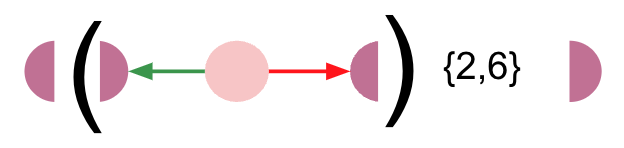

It almosts translates as is into cypher code.

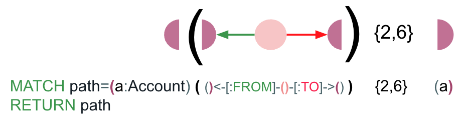

We have the *MVP* of ou query:

```cypher
MATCH (a:Account)
// ◖(◗<-○->◖){2,6}◗
MATCH path=(a)(()<-[:FROM]-()-[:TO]->()){2,6}(a)
RETURN path
```

### Finding a *non-node-repeating* cycle

- QPPs enable us to give names to repeating nodes of a pattern and to use them as lists. `nodes()`function is not necessary anymore.
- `COUNT{}` [subquery expression](https://neo4j.com/docs/cypher-cheat-sheet/5/auradb-enterprise/#_subquery_expressions) makes the syntax easier.
We can check nodes are non-repeating in a concise cypher-only self-explanatory way.

```cypher
MATCH (a:Account)
// ◖(◗<-○->◖){2,6}◗
MATCH path=(a)((a_i)<-[:FROM]-(tx)-[:TO]->(a_j)){2,6}(a)
WHERE COUNT { WITH a_i UNWIND a_i AS b RETURN DISTINCT b } = size(a_i)
RETURN path
```

### Finding a *non-node-repeating* cycle with consistent dates

We now want the dates of the `Transaction` nodes of the cycle to be ordered.

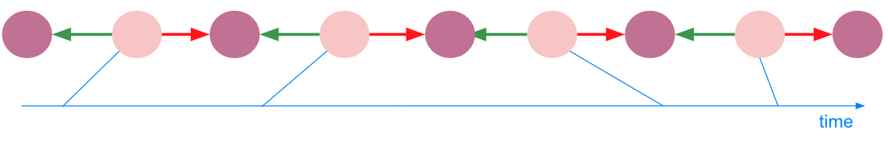

The main point of the use of QPPs is to be able to filter our graph at traversal time to escape the *traverse, produce and filter* bottleneck.
So we need to access to consecutive transactions in the repeating part of our QPP.
Let's reshape it : 

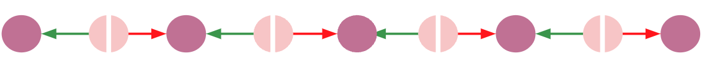
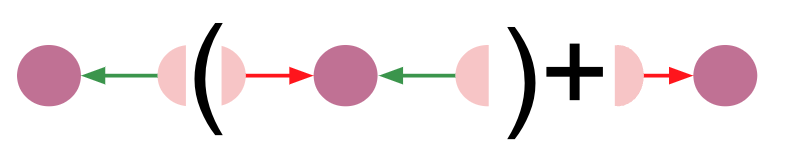
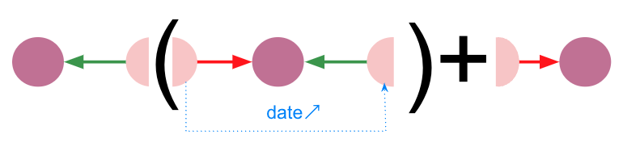

With an inner `WHERE` to express our condition on dates, it translates into cypher :

```cypher
MATCH (a:Account)
// ○<-◖(◗<-○->◖){2,6}◗->○
MATCH path=(a)<-[:FROM]-(first_tx)
    ((tx_i)-[:TO]->(a_i)<-[:FROM]-(tx_j)
        WHERE tx_i.date < tx_j.date
    ){1,6}
    (last_tx)-[:TO]->(a)
WHERE COUNT { WITH a, a_i UNWIND [a] + a_i AS b RETURN DISTINCT b } = size([a] + a_i)
RETURN path
```
### Finding a *20%*-rule-complient *non-node-repeating* cycle with consistent dates

We can add the 20%-rule in a straightforward way inside the WHERE.

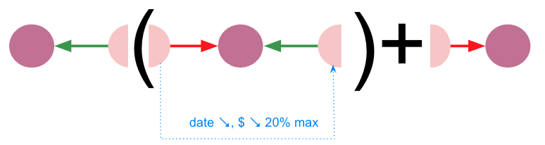

```cypher
MATCH (a:Account)
// ○<-◖(◗<-○->◖)+◗->○
MATCH path=(a)<-[:FROM]-(first_tx)
    ((tx_i)-[:TO]->(a_i)<-[:FROM]-(tx_j)
        WHERE tx_i.date < tx_j.date
        AND tx_i.amount >= tx_j.amount >= 0.80 * tx_i.amount
    ){1,6}
    (last_tx)-[:TO]->(a)
WHERE COUNT { WITH a, a_i UNWIND [a] + a_i AS b RETURN DISTINCT b } = size([a] + a_i)
RETURN path
```
It's now time to remove the 6 length cap on our cycle.
We're quite confident.

```cypher
MATCH (a:Account)
// ○<-◖(◗<-○->◖)+◗->○
MATCH path=(a)<-[:FROM]-(first_tx)
    ((tx_i)-[:TO]->(a_i)<-[:FROM]-(tx_j)
        WHERE tx_i.date < tx_j.date
        AND tx_i.amount >= tx_j.amount >= 0.80 * tx_i.amount
    )+
    (last_tx)-[:TO]->(a)
WHERE COUNT { WITH a, a_i UNWIND [a] + a_i AS b RETURN DISTINCT b } = size([a] + a_i)
RETURN path
```

### Test our query

#### Cleaning

We can clean the database :

```cypher
// WARNING! 
// This DROPs all your indexes and constraints
//
CALL apoc.schema.assert({},{});

// WARNING!
// This erase all your DB content
//
MATCH (n)
CALL {WITH n DETACH DELETE n}
IN TRANSACTIONS OF 100 ROWS
```
#### Ingestion

And import a more realistic [dataset](../data_importer_schema_with_data/importBipartite10Kaccs100Ktxs.zip) with the [data-importer](https://workspace-preview.neo4j.io/workspace/import).

Alternatively, we can ingest the database by running [this script](../cypher_import_from_browser/cypher_script_with_data_bipartite/neo4j_importer_cypher_script.cypher) from the workspace query tab.

#### Needle in Haystack

Let's add a 100-hop cycle needle to our haystack :

```cypher
WITH 100 AS length
UNWIND range(1,length) AS ix
MERGE (a:Account {a_id:toString(ix)})
MERGE (b:Account {a_id:toString(CASE (ix+1)%length WHEN  0 THEN length ELSE (ix+1)%length END)})
CREATE (a)<-[:FROM]-(:Transaction {test:true, amount: (1000*length)-ix, date: datetime()-duration({days: length - ix})})-[:TO]->(b);
```

#### Querying

We can now run our query with no guardrail against 100K+ relationships.

## Review phase

> "Look at the query plan: it's totally different"

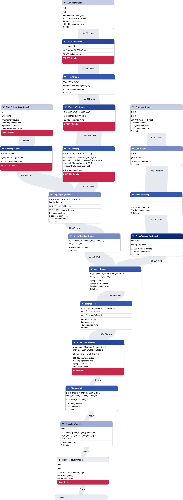

> "Yes. There is a `Filter` process upstream to the `Repeat` process. As expected. That explains a lot. I suppose it's time to go into production now!"

> "Wait a sec! *says the PO everytime* What about access control ? Should the anti-fraud team see the names and email of an Account node ?"

> "Oops... I guess you're right. There is still work to do."

## Runtime

> "Neo4j has just launched a new parallel runtime! Let's try it."


We can enable parallel runtime (not available on free Aura tier).

```cypher
CALL dbms.setConfigValue('internal.cypher.parallel_runtime_support','ALL')
```

And just prepend `CYPHER runtime=parallel` to your query:

```cypher
CYPHER runtime=parallel
MATCH (a:Account)
// ○<-◖(◗<-○->◖)+◗->○
MATCH path=(a)<-[:FROM]-(first_tx)
    ((tx_i)-[:TO]->(a_i)<-[:FROM]-(tx_j)
        WHERE tx_i.date < tx_j.date
        AND tx_i.amount >= tx_j.amount >= 0.80 * tx_i.amount
    )+
    (last_tx)-[:TO]->(a)
WHERE COUNT { WITH a, a_i UNWIND [a] + a_i AS b RETURN DISTINCT b } = size([a] + a_i)
RETURN path
```


## Third sprint - Role-Based Access-Control

### Environment

Role-Based Access-Control is an Enterprise feature of Neo4j. If you want to follow this sprint hands-on, you'll need to work on Neo4j Enterprise. Neo4j Desktop or a [Blank Sandbox](sandbox.neo4j.com) are convenient.

You can ingest the dataset again if needed by running [this script](../cypher_import_from_browser/cypher_script_with_data_bipartite/neo4j_importer_cypher_script.cypher) from the query tab.

### Fine-grained RBAC

We can use [cypher commands](https://neo4j.com/docs/cypher-manual/current/administration/access-control/manage-roles/#access-control-role-syntax) to manage the role-based access-control of our database.

#### Creating a user

Let's first create a user: Anthony from Anti-Fraud Team. 

```cypher
// as admin
CREATE USER Anthony IF NOT EXISTS
    SET PASSWORD 'password'
    SET PASSWORD CHANGE NOT REQUIRED
    SET HOME DATABASE neo4j;
````

```cypher
// as admin
SHOW USERS
```

We can now disconnect from our user (with admin role) to log in to the database again as Anthony (user/password connection mode). In worspace, use the dropdown menu at the top of the screen and *Switch connection*. In Browser, do :

```cypher
// as admin
:server disconnect
```
Let's try to get some data:

```cypher
// as Anthony
MATCH (a:Account)
WITH a LIMIT 1
OPTIONAL MATCH (a)-[r:FROM|TO]-(t:Transaction)
RETURN a, r, t
```

#### Creating a role from a [built-in roles](https://neo4j.com/docs/operations-manual/current/authentication-authorization/built-in-roles/)

Let's connect back as our admin user (with sandbox SSO or with username/password)

We can see the list of user with their roles.

```cypher
// as admin
SHOW USERS
```
Anthony has PUBLIC role only, which is not enough to see data. We could grant him reader built-in role, but let's create a new role that we would be able to set exactly as we want and share with the whole team.

```cypher
// as admin
CREATE ROLE anti_fraud IF NOT EXISTS AS COPY OF reader;
```
#### Granting role to user  

```cypher
// as admin
GRANT ROLE anti_fraud TO Anthony
```

Let's connect again as Anthony to check that we can read some data.

```cypher
// as Anthony
MATCH (a:Account)
WITH a LIMIT 1
OPTIONAL MATCH (a)-[r:FROM|TO]-(t:Transaction)
RETURN a, r, t
```

> "Whoaa! I love the pipe in this query by the way. [Types](https://neo4j.com/docs/cypher-cheat-sheet/5/auradb-enterprise/#_relationship_patterns) and [labels boolean expressions](https://neo4j.com/docs/cypher-cheat-sheet/5/auradb-enterprise/#_node_patterns) are awesome."


```cypher
// as Anthony
MATCH (a:Account)
WITH a LIMIT 1
OPTIONAL MATCH (a)-[r:FROM|TO]-(t:Transaction)
RETURN a{.a_id,.name,.email} AS account, CASE type(r) WHEN "FROM" THEN "sent" ELSE "was sent" END AS verb, t.amount AS amount;
```

> "[Map projection](https://neo4j.com/docs/cypher-cheat-sheet/5/auradb-enterprise/#_lists) of a node!! So elegant.

```cypher
// as Anthony
MATCH (a:Account)
WITH a LIMIT 1
RETURN a{.a_id, .name, .email},
    [(a)-[r:TO|FROM]-(t:Transaction) |
        {role:CASE type(r) WHEN "FROM" THEN "sender" ELSE "beneficiary" END,
        amount:t.amount}
    ] AS transactions;
```

> "And do you like the [pattern comprehension](https://neo4j.com/docs/cypher-cheat-sheet/5/auradb-enterprise/#_lists) syntax ? It makes it even better imho!"


But wait this should not be visible to the Fraud Detection team. Full reader access is too much privilege."

#### Deny privilege to `anti_fraud`

As your admin user:

```cypher
// as admin
DENY READ {name, email}
ON HOME GRAPH
NODES Account TO anti_fraud;
```

```cypher
// as admin
SHOW PRIVILEGES
WHERE role = "anti_fraud" AND access = "DENIED"
```

And test again:

```cypher
// as Anthony
MATCH (a:Account)
WITH a LIMIT 1
RETURN a{.a_id, .name, .email},
    [(a)-[r:TO|FROM]-(t:Transaction) |
        {role:CASE type(r) WHEN "FROM" THEN "sender" ELSE "beneficiary" END,
        amount:t.amount}
    ] AS transactions;
```

> "That's what we want !!"

Even on our sprint 2 query.

```cypher
// as Anthony
MATCH path=(a:Account)<-[:FROM]-(first_tx)
    ((tx_i)-[:TO]->(a_i)<-[:FROM]-(tx_j)
        WHERE tx_i.date < tx_j.date
        AND tx_i.amount >= tx_j.amount >= 0.80 * tx_i.amount
    )+
    (last_tx)-[:TO]->(a)
WHERE COUNT { WITH a, a_i UNWIND [a] + a_i AS b RETURN DISTINCT b } = size([a] + a_i)
RETURN path
```

And the PO to say:

> "The anti-fraud team can do their job in a secure way. I love that! But what about the data scientists? They are quite reluctant to leave their notebooks but they want to access our database..."

## Fourth sprint - Graph Data Science

### Data Scientist Environment

#### Role-Based Access Control

> "Let me first create a user for Daniela, our data scientist"; 

```cypher
CREATE USER Daniela IF NOT EXISTS
    SET PASSWORD 'password'
    SET PASSWORD CHANGE NOT REQUIRED
    SET HOME DATABASE neo4j;
CREATE ROLE data_science IF NOT EXISTS AS COPY OF anti_fraud;
GRANT ROLE data_science TO Daniela;
```

#### Connectors

There are a lot of [connectors](https://neo4j.com/product/connectors/) and [drivers](https://neo4j.com/developer/language-guides/) we can use with Neo4j. The data scientists could use the Python driver, but there is a transaction management overhead they don't need. The best choice for them is the [GDS Python Client](https://neo4j.com/docs/graph-data-science/current/python-client/).

Let's see how to use it from [a Jupyter notebook](../notebooks/data_scientist_connection_to_db.ipynb).

> "Is it returning a [pandas](https://pandas.pydata.org/) dataframe? They will love that."

### Graph Data Science

The [Graph Data Science](https://neo4j.com/docs/graph-data-science/current/) library of Neo4j enables you to project persisted graphs into memory to run 65+ graph theory algorithms, native ML pipelines and graph vizualisation tools against them, in the most efficient way. They are parallelized and optimized to run at scale.

[Here](https://neo4j.com/docs/graph-data-science/current/algorithms/) is an overview of what GDS can do.

#### Project a monopartite graph

Most graph theory algorithm are meant to run on monopartite and/or bipartite graph.

For instance, from our bipartite model, we can build a monopartite graph called `monopartite_account_to_account` with this cypher projection.

```cypher
MATCH (source:Account)<-[:FROM]-(t:Transaction)-[:TO]->(target:Account)
WITH gds.graph.project(
  'monopartite_account_to_account',
  source,
  target,
  { relationshipProperties: t { .amount } }
) AS g
RETURN
  g.graphName AS graph, g.nodeCount AS nodes, g.relationshipCount AS rels
```

They want to know who are the most important accounts of the graph so they built this query :

```cypher
CALL gds.pageRank.stream('monopartite_account_to_account', {
  maxIterations: 20,
  dampingFactor: 0.85,
  relationshipWeightProperty: 'amount'
})
YIELD nodeId, score
RETURN gds.util.asNode(nodeId).name AS name, score
ORDER BY score DESC, name ASC
LIMIT 10
```

And they also want to know if there is disconnected *islands* in the graph.

```
CALL gds.wcc.stream('monopartite_account_to_account')
YIELD nodeId, componentId
WITH count(DISTINCT componentId) AS wcc_num
RETURN CASE wcc_num WHEN 1 THEN true ELSE false END AS is_weekly_connected
```

We can add a disconnected cycle to the graph with the following query.

```cypher
WITH 100 AS length
UNWIND range(1,length) AS ix
MERGE (a:Account {a_id:"_"+toString(ix)})
MERGE (b:Account {a_id:"_"+toString(CASE (ix+1)%length WHEN  0 THEN length ELSE (ix+1)%length END)})
CREATE (a)<-[:FROM]-(:Transaction {test:true, amount: (1000*length)-ix, date: datetime()-duration({days: length - ix})})-[:TO]->(b);
```

You might want to clean in-memory graphs before projecting again.

```cypher
// WARNING!
// This drops all the GDS projections from your current database

CALL gds.graph.list() YIELD graphName AS toDrop
CALL gds.graph.drop(toDrop) YIELD graphName
RETURN "Dropped " + graphName;
```

> "Data Scientists got the ball of wool untangled lightning fast!"