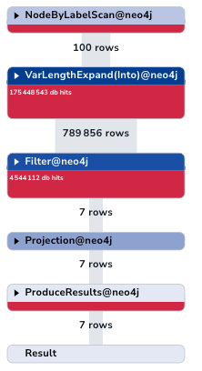
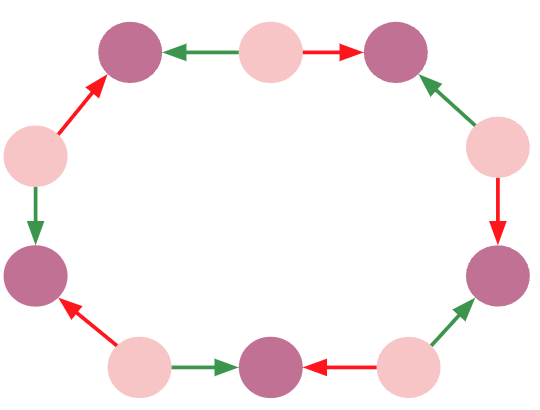
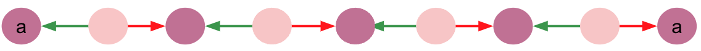
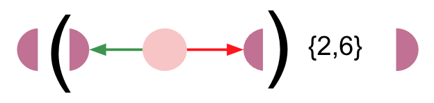
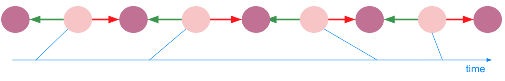
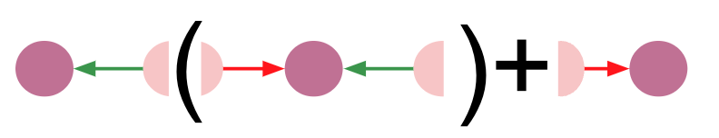

# APP Fraud ring detection query

## Introduction

### Context

A **transaction fraud ring** refers to a group of people collaborating to engage in fraudulent activities, like transferring funds through multiple accounts. They try to **hide their tracks in the multitude of transactions**, but when you take a step back, you see these **patterns** of people hiding their money flows pop-out again from the regular transactions graphs. These rings work across different locations and employ diverse strategies to evade detection. It is critical for financial organizations to detect these rings, especially with enhancement to the Contingent Reimbursement Model (CRM). One of the fastest-growing scams is the Authorized Push Payment (APP) fraud. In the UK, according to UK Finance, it resulted in a loss of over £249 million in the first half of 2022, a 30% increase compared to the same period in 2020.

### Query specification

To detect these frauds, we have to **find non-repeating chronologically-ordered cycles** inside a graph of transactions between accounts. **From one transaction of this cycle to the next one, a slice of the amount (up to 20%) may be taken by the account**. It looks like a great use case for pattern matching with Cypher query language.

![A fraud ring in a monopartite (:Account)-[:TRANSACTION]->(:Account) graph](../assets/images/fraud_ring.png)

## Environment

### Creating a Aura Free instance

The first part of this training can be done with a Neo4j Aura Free instance.

Connect to your [Aura Console](https://console.neo4j.io/).

Create an Aura free instance.

Download [this workspace script](./queries_for_aura_workspace.csv) and load it from the *query tab*.

### Alternatively

You can use Neo4j Desktop and create a Neo4j 5.9+ database. Please install APOC and GDS plugin.


## First sprint - good old Cypher

### Data Modeling

> "Monopartite graphs are the way when you're doing deep traversal of your graph." says some skilled cypher dev.


### Inserting sample data

Let's run this script. It creates 4 accounts and 8 transactions between them from a blank database. It will help us build a cypher query.

```cypher
// WARNING : this erases your data
CALL apoc.schema.assert({},{});
MATCH (n)
CALL {WITH n DETACH DELETE n}
IN TRANSACTIONS OF 100 ROWS;

// Create all accounts
CREATE (a1:Account {a_id: "1"})
CREATE (a2:Account {a_id: "2"})
CREATE (a3:Account {a_id: "3"})
CREATE (a4:Account {a_id: "4"})


// Create relationships between accounts
CREATE (a1)-[:TRANSACTION {amount: 1000, currency: "gbp", date: datetime()-duration({days: 3})}]->(a2)
CREATE (a2)-[:TRANSACTION {amount: 900, currency: "gbp", date: datetime()-duration({days: 2})}]->(a3)
CREATE (a3)-[:TRANSACTION {amount: 810, currency: "gbp", date: datetime()-duration({days: 1})}]->(a4)
CREATE (a4)-[:TRANSACTION {amount: 729, currency: "gbp", date: datetime()}]->(a1)
CREATE (a2)-[:TRANSACTION {amount: 700, currency: "gbp", date: datetime()-duration({days: 6})}]->(a3)
CREATE (a3)-[:TRANSACTION {amount: 978, currency: "gbp", date: datetime()-duration({days: 5})}]->(a4)
CREATE (a4)-[:TRANSACTION {amount: 210, currency: "gbp", date: datetime()-duration({days: 4})}]->(a1)
CREATE (a1)-[:TRANSACTION {amount: 29, currency: "gbp", date: datetime()}]->(a2);
```

Let's look at the resulting schema.

```cypher
CALL db.schema.visualization()
```

### Finding a cycle

Feel free to use [Cypher cheat sheet](https://neo4j.com/docs/cypher-cheat-sheet/5/auradb-enterprise/) as often as you need. Is a great place to find just the information you need about cypher.

#### First: get a node...

```cypher
// Get some nodes
MATCH (n:Account)
RETURN n
LIMIT 10
```

```cypher
// Get a constrained node
MATCH (n:Account {a_id:"2"})
RETURN n
```
```cypher
// Get a constrained node (alternative)
MATCH (n:Account)
WHERE n.a_id = "2"
RETURN n
```

```cypher
// Get aconstrained node (alternative - inner `WHERE`)
MATCH (n:Account WHERE n.a_id = "2")
RETURN n
```

#### ...then a relationship...

```cypher
// Get outgoing tx from node
MATCH (a:Account {a_id:"2"})-[tx:TRANSACTION]->(n)
RETURN a, tx, n
```

#### ... then a path ...

```cypher
// Get outgoing path from a node
MATCH path = (a:Account {a_id:"2"})-[tx:TRANSACTION*0..3]->(n)
RETURN path
LIMIT 10
```

#### ... any path ...

```cypher
// Get outgoing path from a node
MATCH path = (a:Account)-[tx:TRANSACTION*0..3]->(n:Account)
RETURN path
LIMIT 10
```

#### ... finally a cycle

```cypher
// Identify simple transaction ring
MATCH path=(a:Account)-[:TRANSACTION*2..6]->(a)
RETURN path
```

### Finding a *non-node-repeating* cycle

- We can get the nodes of the path as an array with the [path function](https://neo4j.com/docs/cypher-cheat-sheet/5/auradb-enterprise/#_list_expressions) `nodes()`.
- We can get the size of the array with the [list function](https://neo4j.com/docs/cypher-cheat-sheet/5/auradb-enterprise/#_list_expressions) `size`.
- We can distribute an array into rows with [`UNWIND`](https://neo4j.com/docs/cypher-cheat-sheet/5/auradb-enterprise/#_unwind).
- We can remove duplicate rows with `DISTINCT` [operator](https://neo4j.com/docs/cypher-cheat-sheet/5/auradb-enterprise/#_operators) to get non repeating nodes.
- We can [aggregate](https://neo4j.com/docs/cypher-cheat-sheet/5/auradb-enterprise/#_aggregating_functions) and count with `count()`.
- `GROUP BY` is implicit in cypher. This is not a key-word.

We can build a query that filters the path by counting the number of nodes `c_nodes` and comparing it to the number of distinct nodes `c_unique_nodes`.

```cypher
// Identify simple transaction ring
MATCH path=(a:Account)-[:TRANSACTION*2..6]->(a)
UNWIND nodes(path) AS n
WITH path, size(nodes(path)) AS c_nodes, n
WITH DISTINCT path, c_nodes, n
WITH path, c_nodes, count(n) AS c_unique_nodes
WHERE c_nodes = c_unique_nodes + 1
RETURN path
```

We must admit this query is not concise and, worst, not easily readable. We can use [`APOC`](https://neo4j.com/labs/apoc/5/), Neo4j's standard library to get something more human-friendly.

```cypher
// No duplicate
MATCH path=(a:Account)-[tx:TRANSACTION*2..6]->(a)
WHERE size(apoc.coll.toSet(nodes(path))) = size(nodes(path)) - 1
RETURN path
```

### Finding a *non-node-repeating* cycle with consistent dates

We want increasing transaction dates along our cycle.

- We use `range()`to generate a [list](https://neo4j.com/docs/cypher-cheat-sheet/5/auradb-enterprise/#_aggregating_functions) of indices.
- and `all(... WHERE ...)` [list predicate](https://neo4j.com/docs/cypher-cheat-sheet/5/auradb-enterprise/#_list_expressions) to ensure all elements in a list are `true`.

For each path, it enables us to compare dates of consecutive nodes.

```cypher
// Monotonic dates
MATCH path=(a:Account)-[tx:TRANSACTION*2..6]->(a)
WHERE size(apoc.coll.toSet(nodes(path))) = size(nodes(path)) - 1
AND all(idx in range(0, size(tx)-2)
       WHERE (tx[idx]).date < (tx[idx+1]).date
   )
RETURN path
```

### Finding a *20%*-rule-complient *non-node-repeating* cycle with consistent dates

Like what we just did with dates before, we want to compare attributes of consecutive transactions. It fits well in our `all()` list predicate so we will use a `AND` boolean [operator](https://neo4j.com/docs/cypher-cheat-sheet/5/auradb-enterprise/#_operators) to put this rule inside `WHERE`.  

```cypher
MATCH path=(a:Account)-[tx:TRANSACTION*2..6]->(a)
WHERE size(apoc.coll.toSet(nodes(path))) = size(nodes(path)) - 1
AND all(idx in range(0, size(tx)-2)
       WHERE (tx[idx]).date < (tx[idx+1]).date
       AND tx[idx].amount >= tx[idx+1].amount >= 0.80 * tx[idx].amount
   )
RETURN path
```
## Review phase

Our queries run perfectly fine on our sample data but our developper has noticed some limitations :

> "I've made some tests on a more realistic [dataset](../data_importer_schema_with_data/importMonopartite10Kaccs100Ktxs.zip) (I've imported it seemlessly with Aura workspace's [data-importer](https://workspace-preview.neo4j.io/workspace/import) - just *open model (with data)* from three-dot menu). And... well... I'm afraid our query doesn't scale well. By the way I even had to put a limit on the length of the path because when there wasn't any, the query was running forever (or until a memory allocation error)."

Some other developer :

> "The pattern-matching-based *traverse, produce and filter* approach might not scale if the graph is dense and traversals are deep.
In some cases, it produces way to many paths! Look at the PROFILE of the query!
I think filtering at each traversal step is possible.
Did you read [this article](https://medium.com/neo4j/getting-from-denmark-hill-to-gatwick-airport-with-quantified-path-patterns-bed38da27ca1), it seems that we can do much better if we leverage Neo4j 5 new features."



Product owner :

> "Our products needs real-time fraud detection so we need faster queries. We also need to be able to capture long cycles. This has to be the direction of the next sprint!"

## Second sprint - Neo4j 5 Cypher

### Data Modeling

> "We've identified to opportunities to make our query better. One is using `count{<subquery>}` syntax to get rid of `APOC` dependency. The second one is the use of [`quantified path patterns`](https://neo4j.com/docs/cypher-manual/current/patterns/concepts/#quantified-path-patterns). To get the best out of QPPs, we should refactor our model into a bipartite graph."


### Inserting sample data

```cypher
// Clean database
// 
// WARNING! 
// This DROPs all your indexes and constraints
//
CALL apoc.schema.assert({},{});

// WARNING!
// This erase all your DB content
//
MATCH (n)
CALL {WITH n DETACH DELETE n}
IN TRANSACTIONS OF 100 ROWS;

// Create all accounts
CREATE (a1:Account {a_id: 1})
CREATE (a2:Account {a_id: 2})
CREATE (a3:Account {a_id: 3})
CREATE (a4:Account {a_id: 4})


// Create relationships between accounts
CREATE (a1)<-[:FROM]-(:Transaction {amount: 1000, currency: "gbp", date: datetime()-duration({days: 3})})-[:TO]->(a2)
CREATE (a2)<-[:FROM]-(:Transaction {amount: 900, currency: "gbp", date: datetime()-duration({days: 2})})-[:TO]->(a3)
CREATE (a3)<-[:FROM]-(:Transaction {amount: 810, currency: "gbp", date: datetime()-duration({days: 1})})-[:TO]->(a4)
CREATE (a4)<-[:FROM]-(:Transaction {amount: 729, currency: "gbp", date: datetime()})-[:TO]->(a1)
CREATE (a2)<-[:FROM]-(:Transaction {amount: 700, currency: "gdp", date: datetime()-duration({days: 6})})-[:TO]->(a3)
CREATE (a3)<-[:FROM]-(:Transaction {amount: 978, currency: "gdp", date: datetime()-duration({days: 5})})-[:TO]->(a4)
CREATE (a4)<-[:FROM]-(:Transaction {amount: 210, currency: "gdp", date: datetime()-duration({days: 4})})-[:TO]->(a1)
CREATE (a1)<-[:FROM]-(:Transaction {amount: 29, currency: "gdp", date: datetime()})-[:TO]->(a2);
```

Let's look at the resulting schema.

```cypher
CALL db.schema.visualization()
```

### Finding a cycle

In our bipartite model, a fraud ring is a cycle with this shape:


It can be drawn as a path ending where it starts.



The QPP of our query will be a path of repeating patterns *anchored* on both sides on the same node.


In cypher 5.9+, we put the repeating part of the [QPP](https://neo4j.com/docs/cypher-cheat-sheet/5/auradb-enterprise/#_quantified_path_patterns) between parenthesis.


And the number of occurrences (`*`, `+`, `{3}`, `{2,6}`...) comes next.



It almosts translates as is into cypher code.


We have the *MVP* of ou query:

```cypher
MATCH (a:Account)
MATCH path=(a)(()<-[:FROM]-()-[:TO]->()){2,6}(a)
RETURN path
```

### Finding a *non-node-repeating* cycle

- QPPs enable us to give names to repeating nodes of a pattern and to use them as lists. `nodes()`function is not necessary anymore.
- `COUNT{}` [subquery expression](https://neo4j.com/docs/cypher-cheat-sheet/5/auradb-enterprise/#_subquery_expressions) makes the syntax easier.
We can check nodes are non-repeating in a concise cypher-only self-explanatory way.

```cypher
MATCH (a:Account)
MATCH path=(a)((a_i)<-[:FROM]-(tx)-[:TO]->(a_j)){2,6}(a)
WHERE COUNT { WITH a_i UNWIND a_i AS b RETURN DISTINCT b } = size(a_i)
RETURN path
```

### Finding a *non-node-repeating* cycle with consistent dates

We now want the dates of the `Transaction` nodes of the cycle to be ordered.



The main point of the use of QPPs is to be able to filter our graph at traversal time to escape the *traverse, produce and filter* bottleneck.
So we need to access to consecutive transactions in the repeating part of our QPP.
Let's reshape it : 





With an inner `WHERE` to express our condition on dates, it translates into cypher :

```cypher
MATCH (a:Account)
MATCH path=(a)<-[:FROM]-(first_tx)
    ((tx_i)-[:TO]->(a_i)<-[:FROM]-(tx_j)
        WHERE tx_i.date < tx_j.date
    ){2,6}
    (last_tx)-[:TO]->(a)
WHERE COUNT { WITH a, a_i UNWIND [a] + a_i AS b RETURN DISTINCT b } = size([a] + a_i)
RETURN path
```
### Finding a *20%*-rule-complient *non-node-repeating* cycle with consistent dates

We can add the 20%-rule in a straightforward way inside the WHERE.


```cypher
MATCH path=(a:Account)<-[:FROM]-(first_tx)
    ((tx_i)-[:TO]->(a_i)<-[:FROM]-(tx_j)
        WHERE tx_i.date < tx_j.date
        AND tx_i.amount >= tx_j.amount >= 0.80 * tx_i.amount
    )+
    (last_tx)-[:TO]->(a)
WHERE COUNT { WITH a, a_i UNWIND [a] + a_i AS b RETURN DISTINCT b } = size([a] + a_i)
RETURN path
```
