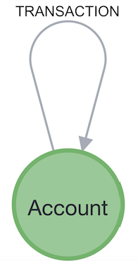

# APP Fraud ring detection query

## Introduction

### Context

A **transaction fraud ring** refers to a group of people collaborating to engage in fraudulent activities, like transferring funds through multiple accounts. They try to **hide their tracks in the multitude of transactions**, but when you take a step back, you see these **patterns** of people hiding their money flows pop-out again from the regular transactions graphs. These rings work across different locations and employ diverse strategies to evade detection. It is critical for financial organizations to detect these rings, especially with enhancement to the Contingent Reimbursement Model (CRM). One of the fastest-growing scams is the Authorized Push Payment (APP) fraud. In the UK, according to UK Finance, it resulted in a loss of over £249 million in the first half of 2022, a 30% increase compared to the same period in 2020.

### Query specification

To detect these frauds, we have to **find non-repeating chronologically-ordered cycles** inside a graph of transactions between accounts. **From one transaction of this cycle to the next one, a slice of the amount (up to 20%) may be taken by the account**. It looks like a great use case for pattern matching with Cypher query language.

![A fraud ring in a monopartite (:Account)-[:TRANSACTION]->(:Account) graph](../assets/images/fraud_ring.png)

## Environment

### Creating a Aura Free instance

The first part of this training can be done with a Neo4j Aura Free instance.

Connect to your [Aura Console](https://console.neo4j.io/).

Create an Aura free instance.

Download [this workspace script](./queries_for_aura_workspace.csv) and load it from the *query tab*.

### Alternatively

You can use Neo4j Desktop and create a Neo4j 5.9+ database. Please install APOC and GDS plugin.


## First sprint - good old Cypher

### Data Modeling

> "Monopartite graphs are the way when you're doing deep traversal of your graph." says some skilled cypher dev.



### Inserting sample data

Let's run this script. It creates 4 accounts and 8 transactions between them from a blank database. It will help us build a cypher query.

```cypher
// WARNING : this erases your data
CALL apoc.schema.assert({},{});
MATCH (n)
CALL {WITH n DETACH DELETE n}
IN TRANSACTIONS OF 100 ROWS;

// Create all accounts
CREATE (a1:Account {a_id: "1"})
CREATE (a2:Account {a_id: "2"})
CREATE (a3:Account {a_id: "3"})
CREATE (a4:Account {a_id: "4"})


// Create relationships between accounts
CREATE (a1)-[:TRANSACTION {amount: 1000, currency: "gbp", date: datetime()-duration({days: 3})}]->(a2)
CREATE (a2)-[:TRANSACTION {amount: 900, currency: "gbp", date: datetime()-duration({days: 2})}]->(a3)
CREATE (a3)-[:TRANSACTION {amount: 810, currency: "gbp", date: datetime()-duration({days: 1})}]->(a4)
CREATE (a4)-[:TRANSACTION {amount: 729, currency: "gbp", date: datetime()}]->(a1)
CREATE (a2)-[:TRANSACTION {amount: 700, currency: "gbp", date: datetime()-duration({days: 6})}]->(a3)
CREATE (a3)-[:TRANSACTION {amount: 978, currency: "gbp", date: datetime()-duration({days: 5})}]->(a4)
CREATE (a4)-[:TRANSACTION {amount: 210, currency: "gbp", date: datetime()-duration({days: 4})}]->(a1)
CREATE (a1)-[:TRANSACTION {amount: 29, currency: "gbp", date: datetime()}]->(a2);
```

Let's look at the resulting schema.

```cypher
CALL db.schema.visualization()
```

### Finding a cycle

Feel free to use [Cypher cheat sheet](https://neo4j.com/docs/cypher-cheat-sheet/5/auradb-enterprise/) as often as you need. Is a great place to find just the information you need about cypher.

#### First: get a node...

```cypher
// Get some nodes
MATCH (n:Account)
RETURN n
LIMIT 10
```

```cypher
// Get a constrained node
MATCH (n:Account {a_id:"2"})
RETURN n
```
```cypher
// Get a constrained node (alternative)
MATCH (n:Account)
WHERE n.a_id = "2"
RETURN n
```

```cypher
// Get aconstrained node (alternative - inner `WHERE`)
MATCH (n:Account WHERE n.a_id = "2")
RETURN n
```

#### ...then a relationship...

```cypher
// Get outgoing tx from node
MATCH (a:Account {a_id:"2"})-[tx:TRANSACTION]->(n)
RETURN a, tx, n
```

#### ... then a path ...

```cypher
// Get outgoing path from a node
MATCH path = (a:Account {a_id:"2"})-[tx:TRANSACTION*0..3]->(n)
RETURN path
LIMIT 10
```

#### ... any path ...

```cypher
// Get outgoing path from a node
MATCH path = (a:Account)-[tx:TRANSACTION*0..3]->(n:Account)
RETURN path
LIMIT 10
```

#### ... finally a cycle

```cypher
// Identify simple transaction ring
MATCH path=(a:Account)-[:TRANSACTION*2..6]->(a)
RETURN path
```

### Finding a *non-node-repeating* cycle

- We can get the nodes of the path as an array with the [path function](https://neo4j.com/docs/cypher-cheat-sheet/5/auradb-enterprise/#_list_expressions) `nodes()`.
- We can get the size of the array with the [list function](https://neo4j.com/docs/cypher-cheat-sheet/5/auradb-enterprise/#_list_expressions) `size`.
- We can distribute an array into rows with [`UNWIND`](https://neo4j.com/docs/cypher-cheat-sheet/5/auradb-enterprise/#_unwind).
- We can remove duplicate rows with `DISTINCT` [operator](https://neo4j.com/docs/cypher-cheat-sheet/5/auradb-enterprise/#_operators) to get non repeating nodes.
- We can [aggregate](https://neo4j.com/docs/cypher-cheat-sheet/5/auradb-enterprise/#_aggregating_functions) and count with `count()`.
- `GROUP BY` is implicit in cypher. This is not a key-word.

We can build a query that filters the path by counting the number of nodes `c_nodes` and comparing it to the number of distinct nodes `c_unique_nodes`.

```cypher
// Identify simple transaction ring
MATCH path=(a:Account)-[:TRANSACTION*2..6]->(a)
UNWIND nodes(path) AS n
WITH path, size(nodes(path)) AS c_nodes, n
WITH DISTINCT path, c_nodes, n
WITH path, c_nodes, count(n) AS c_unique_nodes
WHERE c_nodes = c_unique_nodes + 1
RETURN path
```

We must admit this query is not concise and, worst, not easily readable. We can use [`APOC`](https://neo4j.com/labs/apoc/5/), Neo4j's standard library to get something more human-friendly.

```cypher
// No duplicate
MATCH path=(a:Account)-[tx:TRANSACTION*2..6]->(a)
WHERE size(apoc.coll.toSet(nodes(path))) = size(nodes(path)) - 1
RETURN path
```

### Finding a *non-node-repeating* cycle with consistent dates

We want increasing transaction dates along our cycle.

- We use `range()`to generate a [list](https://neo4j.com/docs/cypher-cheat-sheet/5/auradb-enterprise/#_aggregating_functions) of indices.
- and `all(... WHERE ...)` [list predicate](https://neo4j.com/docs/cypher-cheat-sheet/5/auradb-enterprise/#_list_expressions) to ensure all elements in a list are `true`.

For each path, it enables us to compare dates of consecutive nodes.

```cypher
// Monotonic dates
MATCH path=(a:Account)-[tx:TRANSACTION*2..6]->(a)
WHERE size(apoc.coll.toSet(nodes(path))) = size(nodes(path)) - 1
AND all(idx in range(0, size(tx)-2)
       WHERE (tx[idx]).date < (tx[idx+1]).date
   )
RETURN path
```